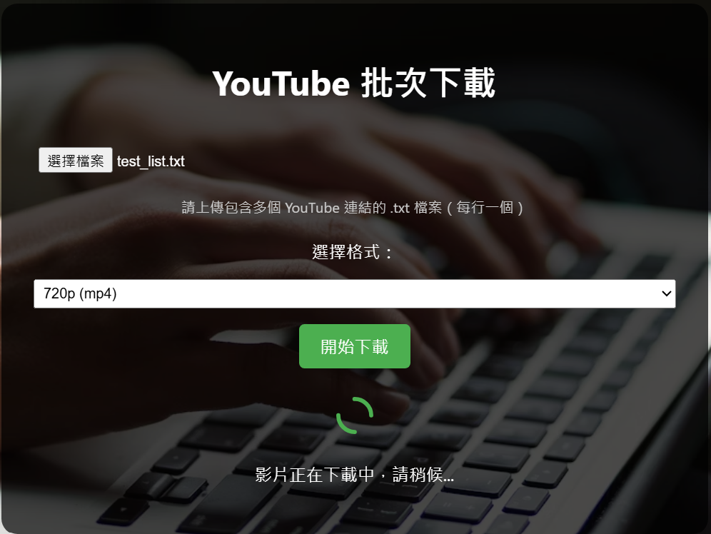

# yt-dlp-with-flask

自己的汽車中控雖然可以連熱點上YT放音樂，但每次上車都要讓他連線，有時候高速公路進隧道訊號不好就沒聲音了，很煩人！因此打算自己存音樂放在USB裡面可以在車上播放~
但在外面用第三方網頁的都只能一個一個連結貼，一個一個按下載，就打算自己寫一個可以批量下載並壓縮的小玩意~

# Install
```bash
pip install -r requirements.txt
```

麻煩的來了，要下載 `ffmpeg` 並加入環境變數，我的作法是從[這裡](https://www.gyan.dev/ffmpeg/builds/)下載並解壓縮後，把 `bin` 的路徑複製到環境變數中。

如果是用虛擬環境建立的朋友看過來！記得把你的路徑貼在`uploads/download_process.py`~~
```python
ydl_opts = {
    ...,
    ...,
    'ffmpeg_location': r'\bin'
    }
```

執行！
```bash
python app.py
```


# Usage

目前設定的使用方式是使用者自己開一個 `.txt` 檔案，並以每行一個連結的方式貼上要下載的影片連結，接著將其上傳至頁面即可～


在下載過程中增加了轉圈圈的動畫，讓使用者知道正在下載


最後會各自顯示每部影片的下載狀態


# 提醒
因為是自己用的小專案，就沒有用 Ajax 去提升 UX~


